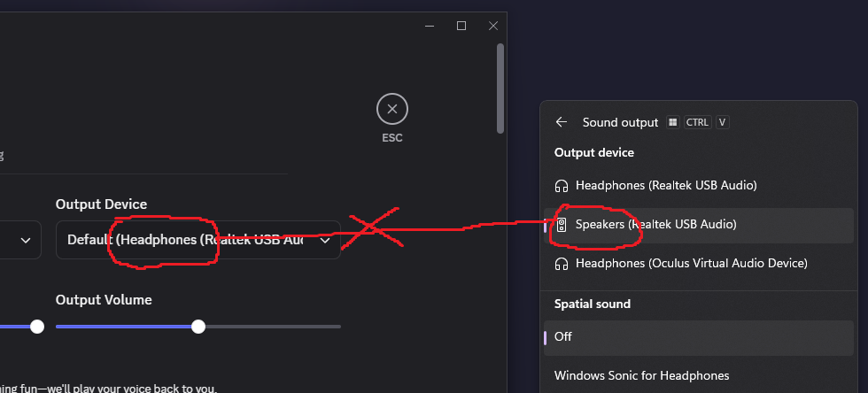
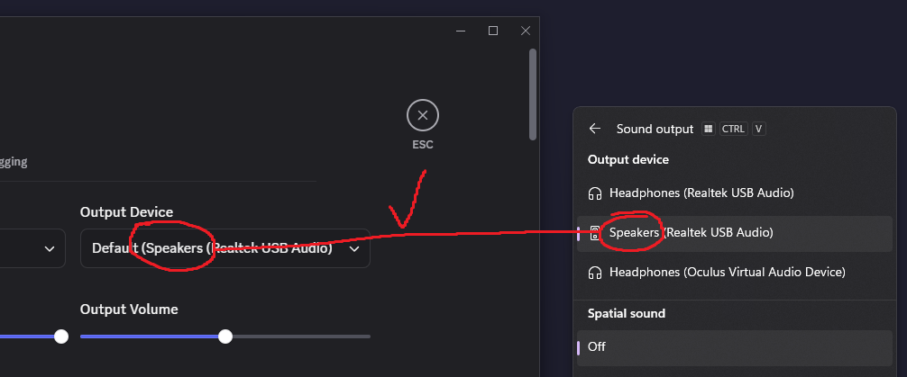

# SyncCommAudio

SyncCommAudio is a Windows service written in Python that fixes an issue I have with default audio devices in Windows, the way the default audio device can be different from the default communication device. This service works by checking if the default communication device is different from the audio device and then setting the default communication device to the same as the default audio device. It fixes the issue with Discord and other chatting apps not using the correct default audio device. 

### Before:

What Discord says the default output device is and what Windows says the default output device is are not the same.
### After:

What Discord says the default output device is and what Windows says the default output device is are now synchronized.

## Installation

An automated installer is planned, but is not yet ready. To install SyncCommAudio, you need to clone the repository, install the requirements, and run the installation command. This code snipped assumes you installed Python using [Chocolatey](https://community.chocolatey.org/packages/python). If you have not installed Python through Chocolatey, install it from [https://www.python.org/](https://www.python.org/) or from Chocolatey by running `choco install python --pre`.
```
git clone https://github.com/notkirb/SyncCommAudio/
cd SyncCommAudio
C:\Python313\python.exe -m pip install -r requirements.txt
C:\Python313\python.exe service.py --startup=auto install
C:\Python313\python.exe service.py start
```

NOTE: Make sure you are NOT using Python from the Windows Store. The Windows Store version does not support services, and therefore cannot be used for SyncCommAudio. You can install it from [https://www.python.org/](https://www.python.org/) or from [Chocolatey](https://community.chocolatey.org/packages/python) by running `choco install python --pre` assuming Chocolatey is installed on your system.
